# 📦 Inventory Service — Mimbral OMS Integration

**Versión:** 1.0.0
**Stack:** Node.js 18 · Express · SQL Server 2019 · KafkaJS · SAP B1 Service Layer · Docker Compose
**Autor:** Williams Mejías / Mimbral IT

---

## 🧭 Propósito

Microservicio encargado de la **gestión de inventarios** y **movimientos de stock** dentro del ecosistema Mimbral OMS. Sincroniza información entre SAP Business One, VTEX y los sistemas internos mediante eventos Kafka, integración REST y procedimientos almacenados SQL Server.

Funciones principales:

* Registrar y aplicar **movimientos de stock** (entradas, salidas, transferencias, recepciones de compra).
* Mantener una **cola de integración (IntegrationQueue)** para enviar documentos a SAP B1.
* Escuchar **eventos Kafka** (por ejemplo, `sap.purchaseorder.cancelled`) para actualizar el estado local.
* Sincronizar periódicamente **órdenes de compra abiertas** desde SAP (`OPOR` → `PurchaseOrders`).
* Exponer API REST para consultar stock, movimientos y documentos de inventario.
* Generar snapshots en `SapDocuments` para trazabilidad completa.

---

## ⚙️ Estructura de carpetas

```
/src
├── config/           # Configuración de DB, SAP, Kafka, entorno
├── controllers/      # Controladores HTTP
├── models/           # Acceso directo a la BD (mssql)
├── routes/           # Endpoints Express agrupados
├── services/         # Lógica de negocio y validaciones
├── kafka/            # Consumers de eventos SAP/VTEX
├── producer/         # Productores Kafka
├── workers/          # Cron jobs y workers de integración SAP
├── jobs/             # Scripts autónomos (batch / polling)
└── server.js         # Entry point principal del microservicio
```

---

## 🌐 Endpoints principales (REST API)

| Método | Ruta                                  | Descripción                                  |
| ------ | ------------------------------------- | -------------------------------------------- |
| `GET`  | `/api/health`                         | Verifica estado del servicio                 |
| `GET`  | `/api/ready`                          | Confirma si está listo para tráfico          |
| `GET`  | `/api/version`                        | Versión del microservicio                    |
| `POST` | `/api/movements`                      | Registra un movimiento (usa `applyMovement`) |
| `GET`  | `/api/movements`                      | Lista movimientos registrados                |
| `GET`  | `/api/stock/by-warehouse`             | Consulta stock por SKU y almacén             |
| `POST` | `/api/po/upsert`                      | Inserta/actualiza una orden de compra local  |
| `GET`  | `/api/po/open-lines`                  | Lista líneas abiertas de OC                  |
| `GET`  | `/api/po/:docEntry`                   | Detalle por DocEntry                         |
| `POST` | `/api/integration/dispatch`           | Despacha lote de documentos a SAP            |
| `GET`  | `/api/integration/sap-payload/:docId` | Previsualiza payload SAP SL antes del envío  |

---

## 🧩 Integraciones principales

### 🔁 SAP Business One (Service Layer)

* Autenticación vía `/Login` con sesión persistente (`B1SESSION`).
* Builders dedicados: `buildOPDN`, `buildOIGN`, `buildOIGE`, `buildOWTR`.
* Función central `dispatchBatch()` en `sapWorker.js` que recorre `IntegrationQueue` y postea docs pendientes.
* Guardado de snapshots (payload + respuesta) en `SapDocuments`.

### 🔊 Kafka

* Usa **kafkajs**.
* Consumer: `poEventsConsumer.js` escucha `sap.purchaseorder.cancelled`.
* Producer: `producer/index.js` (helper genérico para emitir eventos outbox).
* Idempotencia gestionada vía tabla `EventInbox` y columna `idempotencyKey`.

### 🕓 Cron / Jobs

* `cronRunner.js` ejecuta:

  * `dispatchBatch()` cada 1 minuto (envío SAP).
  * `syncOpenPOsFromDB()` cada 5 minutos (sincronización OC SAP).
* `sapPOFetcherDirect.js` implementa el polling de SAP (`OPOR` + `POR1`) por `UpdateDate/Time` con cursor incremental (`SyncState`).

---

## 🗃️ Esquema de Base de Datos (SQL Server)

### Tablas Core

| Tabla                    | Descripción                                                              |
| ------------------------ | ------------------------------------------------------------------------ |
| `InventoryDocuments`     | Cabecera de documentos de inventario (EP, EM, SM, TT).                   |
| `InventoryDocumentLines` | Líneas asociadas a cada documento.                                       |
| `StockMovements`         | Movimientos básicos aplicados vía SP `apply_movement`.                   |
| `IntegrationQueue`       | Cola de integración con SAP; se alimenta desde `enqueueIntegrationDB()`. |
| `SapDocuments`           | Snapshot de payloads enviados a SAP.                                     |
| `EventInbox`             | Control de idempotencia Kafka.                                           |
| `ProcessedEvents`        | Auditoría de eventos ya procesados.                                      |

### Sincronización OC SAP

| Tabla / Vista               | Descripción                                    |
| --------------------------- | ---------------------------------------------- |
| `PurchaseOrders`            | Cabecera de órdenes de compra locales.         |
| `PurchaseOrderLines`        | Líneas asociadas a cada orden.                 |
| `vw_PurchaseOrderOpenLines` | Vista auxiliar de líneas abiertas.             |
| `SyncState`                 | Guarda cursores (timestamp o UpdateDate/Time). |
| `SyncCheckpoints`           | Controla último estado procesado por entidad.  |

### Catálogos y Stock

| Objeto                 | Descripción                                                                                                                  |
| ---------------------- | ---------------------------------------------------------------------------------------------------------------------------- |
| `Items` / `Warehouses` | Catálogos de ítems y almacenes.                                                                                              |
| `ItemWarehouseStock`   | Niveles por SKU/almacén. Campos: `onHandQty`, `salesCommitQty`, `purchaseOrdQty`, `blocked`, `safetyStock`, `infiniteStock`. |
| `vw_StockByWarehouse`  | Vista principal para `/api/stock/by-warehouse`.                                                                              |
| `vw_StockTotals`       | Totales por SKU.                                                                                                             |

### Procedimientos y TVP

| Tipo | Nombre                      | Uso                                                       |
| ---- | --------------------------- | --------------------------------------------------------- |
| SP   | `apply_movement`            | Registra movimientos de inventario.                       |
| SP   | `enqueue_integration`       | Encola doc en `IntegrationQueue`.                         |
| SP   | `upsert_purchase_order`     | Inserta/actualiza OC y líneas.                            |
| SP   | `list_movements`            | Lista movimientos con filtros/paginación.                 |
| TVP  | `PurchaseOrderLineType`     | TVP usado en `poModel.js` para insertar múltiples líneas. |
| TVP  | `InventoryDocumentLineType` | TVP para líneas de inventario (opcional según versión).   |

### Relaciones principales

```
InventoryDocuments 1─∞ InventoryDocumentLines
InventoryDocuments 1─∞ IntegrationQueue
IntegrationQueue 1─1 SapDocuments
PurchaseOrders 1─∞ PurchaseOrderLines
```

---

## 🔒 Idempotencia y Trazabilidad

* **Kafka**: `EventInbox` evita reprocesar el mismo evento `idempotencyKey`.
* **SAP**: cada envío queda registrado en `SapDocuments`.
* **Movimientos**: SP `apply_movement` garantiza atomicidad y validación (`type`, `quantity > 0`).
* **OC Sync**: `SyncState` persiste cursores `DATE`/`TIME` para continuar donde quedó el polling.

---

## 🧠 Variables de entorno (.env)

```env
PORT=5005
DB_HOST=host.docker.internal
DB_USER=user_inventory
DB_PASSWORD=Mimbral1579
DB_NAME=new_inventory_service_db
DB_PORT=1433
SAP_DB_HOST=192.168.0.24
SAP_DB_USER=user_inventory
SAP_DB_PASSWORD=Mimbral_!234
SAP_DB_NAME=COMERCIAL_CIERRE_TEST
KAFKA_ENABLE=1
KAFKA_BROKER=kafka:9092
KAFKA_CLIENT_ID=inventory-service
KAFKA_GROUP_ID=inventory-service-po-events
KAFKA_PO_TOPICS=sap.purchaseorder.cancelled
KAFKA_FROM_BEGINNING=1
ENABLE_CRON=1
LOG_SAP=1
SAP_BASE_URL=https://win-hp03dio6fsk:50000/b1s/v1
SAP_COMPANY_DB=COMERCIAL_CIERRE_TEST
SAP_USERNAME=manager
SAP_PASSWORD=mngr
```

---

## 🐳 Docker & Despliegue

### docker-compose.yml

```yaml
version: '3.8'
services:
  inventory-service:
    build: .
    ports:
      - "5005:5005"
    networks:
      - orders-service_kafka_network
    environment:
      LOG_SAP: "1"
      ENABLE_CRON: "1"
  inventory-worker:
    build: .
    command: ["node","src/workers/cronRunner.js"]
    networks:
      - orders-service_kafka_network
```

### Dockerfile

```dockerfile
FROM node:18
WORKDIR /app
COPY package*.json ./
RUN npm install
COPY . .
EXPOSE 5005
CMD ["npm", "start"]
```

---

## 🧾 Scripts npm

| Script                    | Descripción                                 |
| ------------------------- | ------------------------------------------- |
| `npm start`               | Inicia el servidor Express principal.       |
| `npm run consumer`        | Ejecuta consumer Kafka manualmente.         |
| `npm run job:integration` | Worker de integración SAP.                  |
| `npm run job:sapSync`     | Sincronización manual de órdenes de compra. |

---

## 🧱 Orden de despliegue BD (recomendado)

1. Crear TVP (`PurchaseOrderLineType`, `InventoryDocumentLineType`).
2. Crear tablas base (`InventoryDocuments`, `IntegrationQueue`, etc.).
3. Crear vistas (`vw_StockByWarehouse`, `vw_PurchaseOrderOpenLines`).
4. Crear SP (`apply_movement`, `upsert_purchase_order`, etc.).
5. Insertar configuraciones iniciales en `SyncState`, `Warehouses`, `Items`.

Ejemplo con `sqlcmd`:

```bash
sqlcmd -S localhost -d new_inventory_service_db -U sa -P 4951sF67l -i schema.sql
```

---

## 📊 Logs y monitoreo

* **SAP**: controlado por `LOG_SAP=1` → imprime payloads y respuestas SL.
* **Kafka**: logs detallados con `KAFKA_LOG_MSG=1`.
* **Cron**: registro automático en stdout cada minuto.

---

## ✅ Estado y monitoreo

* Healthcheck: `GET /api/health` → `{ ok: true }`.
* Ready: `GET /api/ready` → `{ ok: true }`.
* Version: `GET /api/version` → `{ version: '1.0.0' }`.

---

## 🧩 Resumen general de flujo

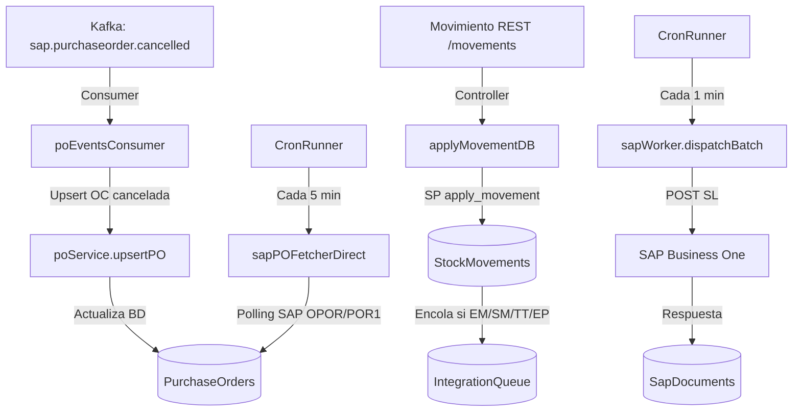

---

## 🧰 Recomendaciones

* Activar `LOG_SAP` solo en entornos de QA.
* Revisar certificados si SAP usa HTTPS interno.
* Asegurar sincronía entre TZ de SAP y Node (`SAP_TZ_OFFSET_MINUTES`).
* Limpiar `IntegrationQueue` periódicamente (mantener últimos 90 días).

---

## 📚 Créditos

Desarrollado por **Williams Mejías**
Integración entre SAP Business One 10.0 y Mimbral OMS
© Sociedad Comercial El Mimbral Ltda.

---

## 🧱 Arquitectura Lógica

```mermaid
flowchart LR
  subgraph ClientApps[Apps clientes]
    UI[OMS / Backoffice / Integraciones]
  end

  UI -->|REST| API[Inventory Service (Express)]
  API --> Ctrls[Controllers]
  Ctrls --> Svcs[Services]
  Svcs --> Models[Models]

  Models --> SQL[(SQL Server
new_inventory_service_db)]
  Svcs --> KFK[(Kafka Broker)]
  Svcs --> SAPSL[(SAP B1
Service Layer)]
  Svcs --> VTEX[(VTEX API)]

  subgraph Workers[Workers & Cron]
    CRON[cronRunner.js]
    W1[sapWorker.dispatchBatch]
    W2[sapPOFetcherDirect]
  end

  CRON --> W1
  CRON --> W2
  W1 -->|POST OPDN/OIGN/OIGE/OWTR| SAPSL
  W2 --> SAPDB[(SAP DB
OPOR/POR1)]

  KFK -->|sap.purchaseorder.cancelled| CONSUMER[poEventsConsumer]
  CONSUMER --> INBOX[(EventInbox /
ProcessedEvents)]

  W1 --> SNAP[(SapDocuments
Snapshots)]
```

---

## 🧩 Arquitectura Física / Despliegue

```mermaid
flowchart TB
  subgraph Host[Host / VM]
    subgraph Docker[Docker Engine]
      subgraph Compose[docker-compose]
        SVC[inventory-service
(Express API)]
        WRK[inventory-worker
(cronRunner)]
      end
    end
  end

  NET[(orders-service_kafka_network)]
  SVC --- NET
  WRK --- NET

  KAFKA[(Kafka Cluster)] --- NET

  DBINV[(SQL Server
new_inventory_service_db)]
  SVC <---> DBINV
  WRK <---> DBINV

  SAPSL[(SAP Service Layer
https://win-hp03dio6fsk:50000/b1s/v1)]
  SVC <---> SAPSL
  WRK <---> SAPSL

  SAPDB[(SQL Server SAP
OPOR/POR1)]
  WRK <---> SAPDB

  VTEX[(VTEX SaaS)] --- SVC

  note right of SVC: Expuesto en :5005 (HTTP)
  note left of DBINV: Credenciales DB_* (.env)
```

---

## 🔄 Secuencia — EP (Entrada por Compra)

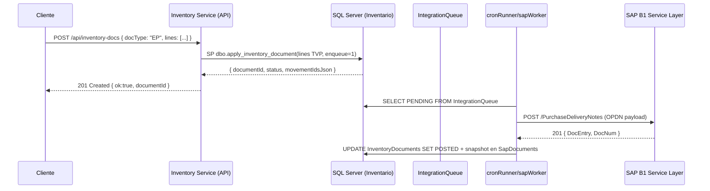

---

# 🧬 Secuencias completas (teoría de punta a punta)

> A continuación se describen **todas las secuencias funcionales** del microservicio, en términos teóricos, para entender el flujo end‑to‑end entre API, BD, colas de integración, cron workers, SAP B1 (Service Layer y DB), y Kafka.

## 1) Crear Documento de Inventario (capa API) → `EP|EM|SM|TT`

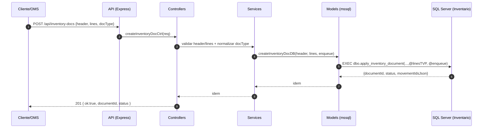

## 2) Aplicar Movimiento simple (sin documento) → `/api/movements`

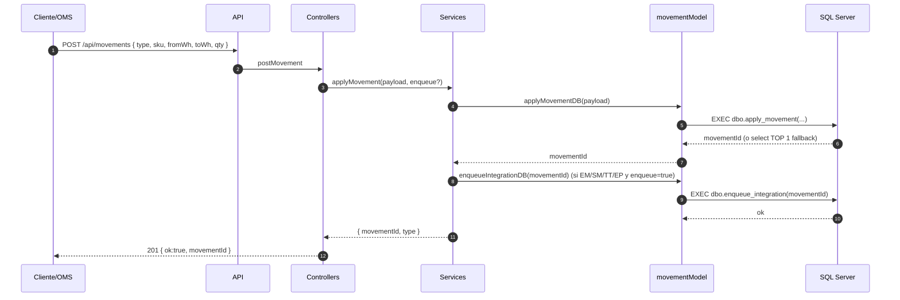

## 3) Despacho a SAP (cron) — `dispatchBatch()`

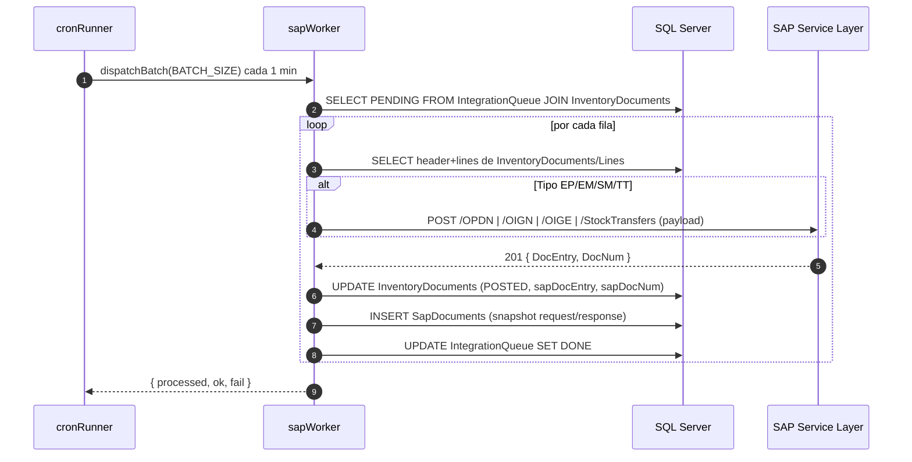

## 4) Previsualizar payload SAP (sin enviar)

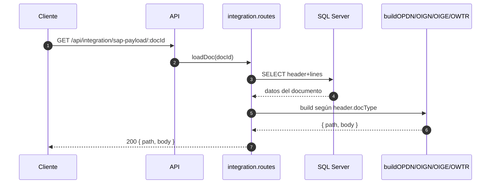

## 5) Sincronización OC desde SAP DB (`OPOR`/`POR1`) — `sapPOFetcherDirect`

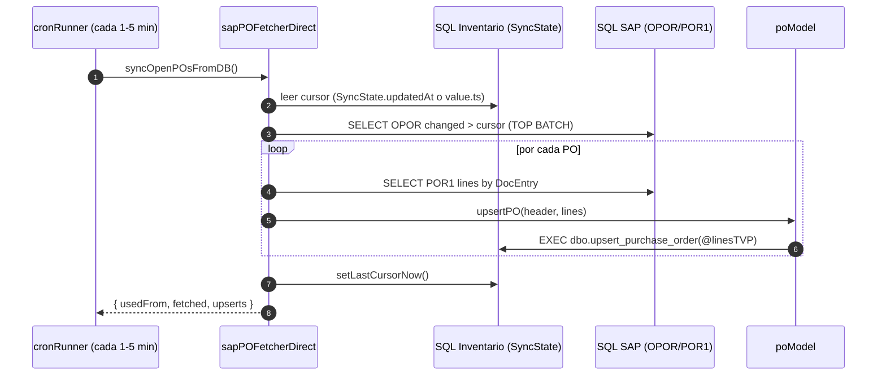

## 6) Evento Kafka — OC Cancelada (`sap.purchaseorder.cancelled`)

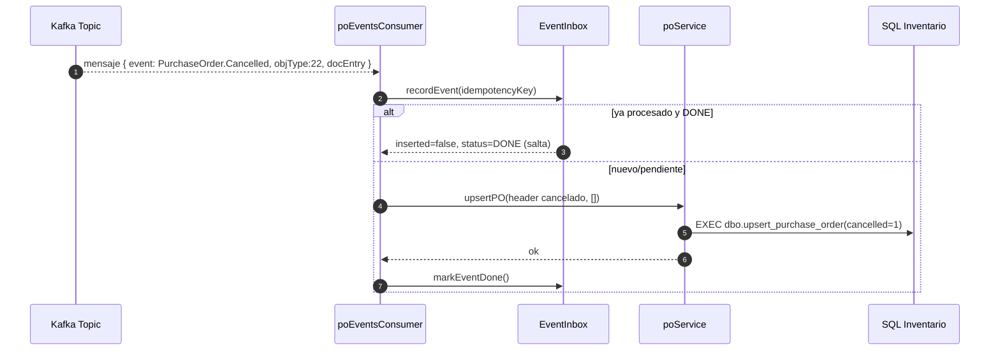

## 7) Consultas HTTP — Stock por bodega

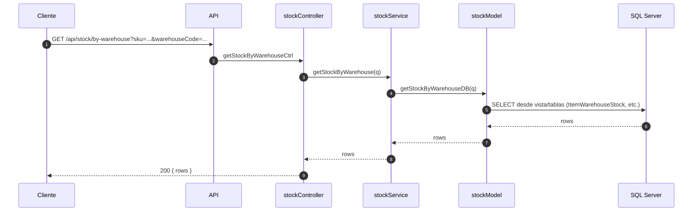

## 8) Consultas HTTP — Listado de movimientos

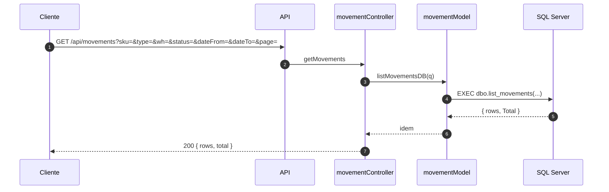

## 9) Ciclo de vida del servidor y cron/consumer

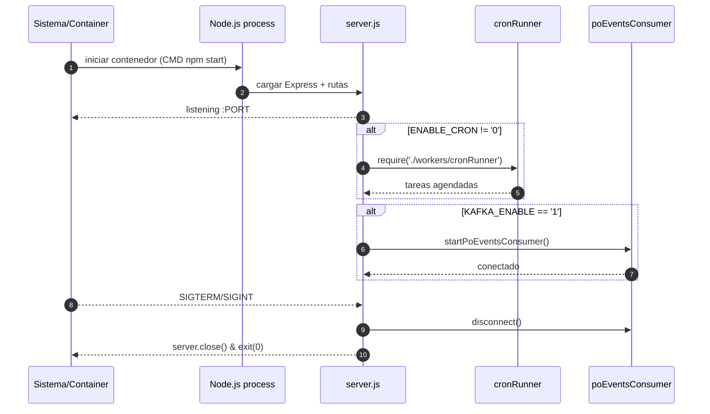

## 10) Errores SAP y reintento automático

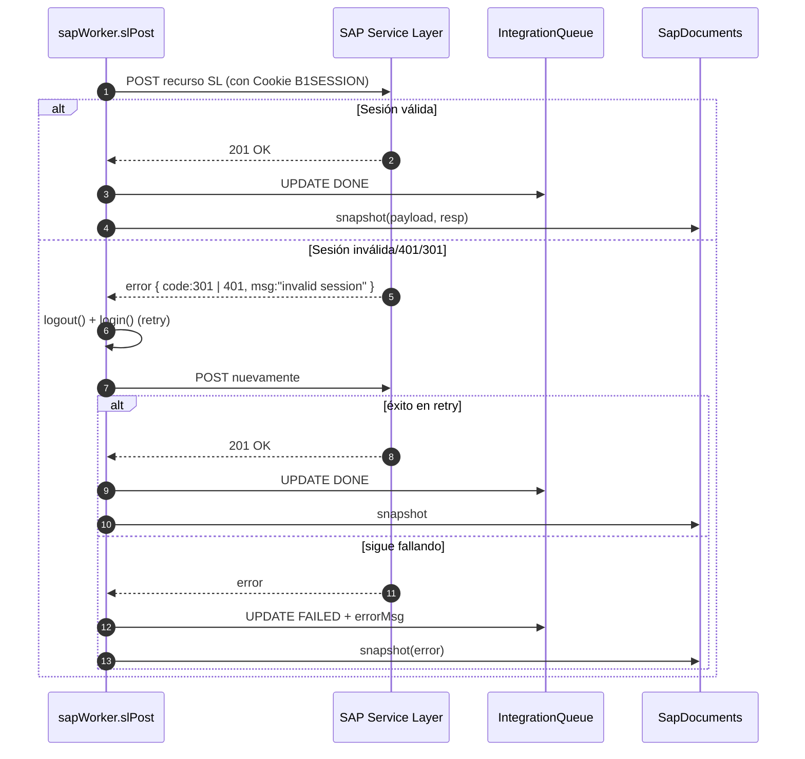

---

> Estas secuencias cubren **creación/aplicación**, **despacho a SAP**, **sincronización de OC**, **consumo de eventos Kafka**, y **consultas**. Si necesitas profundizar en un flujo específico (p.ej. **Transferencias TT** con validación de `fromWh/toWh` a nivel línea), lo detallamos con reglas de validación adicionales y ejemplos de payload.
